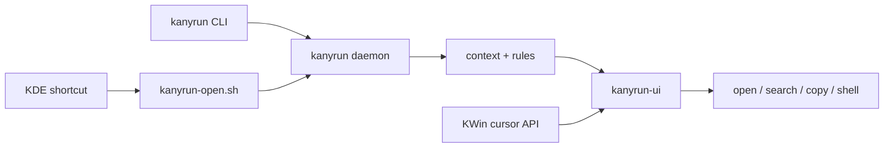

<h1 align="center">Kanyrun</h1>

<p align="center">
  <strong>KDE Wayland context launcher inspired by RunAny.</strong><br>
  Open Anyrun-style quick menus for files, text, URLs, and shell actions at the cursor.
</p>

<p align="center">
  <a href="#what-is-this">What is this?</a> |
  <a href="#features">Features</a> |
  <a href="#installation">Installation</a> |
  <a href="#quick-start">Quick Start</a> |
  <a href="#configuration">Configuration</a>
</p>

<p align="center">
  English | <a href="README_CN.md">中文</a>
</p>

---

<p align="center">
  <video src="https://github.com/user-attachments/assets/1fe6bf0e-47ad-4353-988d-1ebeed68a389" controls width="100%"></video>
</p>

> [!NOTE]
> Kanyrun is currently designed for KDE Plasma 6 on Wayland. It uses KDE/KWin behavior and APIs, so it is not intended to be a generic GNOME, X11, macOS, or Windows launcher.

## What is this?

Kanyrun is a lightweight KDE Plasma 6 / Wayland context launcher. It opens an Anyrun-style menu for the current text, URL, file, directory, or selected file list, then runs the configured action: open a PDF, reveal an image in Dolphin, search selected text, copy a path, or launch any shell command.

The project is inspired by [RunAny](https://github.com/hui-Zz/RunAny), especially its quick launcher, context actions, and "one configuration, many actions" idea. Kanyrun keeps that style of simple menu configuration, but changes the platform model: instead of Windows and AutoHotkey, it targets KDE Plasma, Wayland, KWin cursor positioning, Qt 6, LayerShellQt, and a Rust daemon.



## Features

- **KDE Wayland first** - places the menu using KWin-aware cursor handling instead of X11 assumptions.
- **Anyrun-style quick menus** - trigger compact action menus from a keyboard shortcut without opening a full launcher window.
- **Context menus for files and text** - resolves URLs, plain text, files, directories, file lists, MIME types, and extension-specific menus.
- **RunAny-style menu files** - keeps a compact `menu.ini` format with submenus, default actions, separators, and shell commands.
- **Resident daemon** - keeps config, rules, and the warm UI path ready for repeated shortcut use.
- **Native Qt menu UI** - uses Qt 6 and LayerShellQt for a desktop menu surface that can be dismissed between launches.
- **External selection script** - `kanyrun-open.sh` accepts explicit file arguments or uses a copy shortcut fallback for tools such as Dolphin and file search apps.
- **Direct actions** - open URLs, search providers, copy text, copy paths, open files, open directories, reveal files, or run custom commands.
- **Debug timing on demand** - `--debug` enables timing logs; normal launches avoid timing instrumentation overhead.

## Credits

Kanyrun is inspired by RunAny by hui-Zz. RunAny showed how far a compact quick-launch and context-action system can go when it combines categories, shortcuts, rules, search, and scriptable actions. Kanyrun is not a port of RunAny; it is a KDE Plasma / Wayland implementation with a different runtime and desktop integration model.

## What We Kept

- A plain text menu file that is easy to edit and sync.
- Category-like quick menus with default actions.
- Context-aware behavior: the same shortcut can act differently for text, URLs, files, directories, or selected file lists.
- Shell-friendly customization instead of a closed plugin model.

## What Changed And Added

### 1. KDE / KWin Integration

Kanyrun assumes KDE Plasma 6 and Wayland. The UI positioning path is built around KWin cursor information and LayerShellQt, so the menu can open near the active pointer position without pushing coordinate logic into shell scripts.

### 2. Rust Core With A Warm Daemon

The Rust CLI parses context, loads configuration, resolves rules, and talks to a resident daemon by default. The daemon keeps the hot path ready and can keep a warm UI child for faster repeated launches.

### 3. Unix-Style Shell Boundary

`kanyrun-open.sh` remains a glue layer for external programs and keyboard shortcuts. Core menu logic stays in `kanyrun`; the script only collects or forwards context and can emit debug timing logs when called with `--debug`.

### 4. Debug Timing Without Hot Path Cost

Timing logs are opt-in:

```sh
kanyrun --debug --menu --files /tmp/example.pdf
kanyrun-open.sh --debug /tmp/example.pdf
```

Without `--debug`, timing spans are disabled and the shell launcher does not write timing logs.

## Tech Stack

| Layer | Technology |
| --- | --- |
| Core CLI and daemon | Rust, serde, TOML, Unix domain sockets |
| Context detection | Explicit CLI args, primary selection, clipboard, MIME guessing |
| Menu UI | C++17, Qt 6 Widgets, Qt DBus, LayerShellQt |
| Desktop integration | KDE Plasma 6, Wayland, KWin APIs |
| Launcher glue | POSIX-style Bash script, `dotool` / `wtype` fallback for copy shortcuts |
| Configuration | `config.toml`, RunAny-style `menu.ini` |

## Installation

### From the release bundle in this repository

```sh
bash release/install.sh
```

The installer writes:

- Binaries to `~/.local/share/kanyrun/`
- Command symlink to `~/.local/bin/kanyrun`
- User config to `~/.config/kanyrun/`
- Default bundled config to `~/.local/share/kanyrun/config/`

### Build from source

Prerequisites:

- Rust toolchain with Cargo
- CMake
- Qt 6 Core, Gui, Widgets, and DBus development files
- LayerShellQt development headers and runtime library
- KDE Plasma 6 on Wayland for real desktop use

```sh
git clone https://github.com/sullevy/Kanyrun.git
cd Kanyrun
bash scripts/build-release.sh
bash release/install.sh
```

## Quick Start

1. Build and install Kanyrun with `bash scripts/build-release.sh` and `bash release/install.sh`.
2. Run `kanyrun` to open the default root menu.
3. Bind a KDE global shortcut to `~/.local/bin/kanyrun` for the default menu.
4. Bind another shortcut to `~/.local/share/kanyrun/kanyrun-open.sh` for context menus from selected files or current text.
5. Edit `~/.config/kanyrun/menu.ini` to add your real commands.
6. Edit `~/.config/kanyrun/config.toml` to adjust providers, rules, and fallback menus.
7. Use `kanyrun --help` to inspect CLI flags.
8. Use `--debug` only when measuring launch timing.

## Configuration

Kanyrun uses two main files:

- `~/.config/kanyrun/config.toml` - rules, providers, UI switches, and default menu file.
- `~/.config/kanyrun/menu.ini` - quick menu structure and commands.

Minimal `menu.ini` example:

```ini
*Search|@search:duckduckgo
GitHub search|@search:github
Copy text|@copy-text

-PDF::pdf
    *Open PDF|@open-file
    Show in folder|@reveal-file
    Copy path|@copy-path

-Directory::directory
    *Open folder|@open-file
    Copy path|@copy-path
```

Built-in actions:

- `@search:<provider>`
- `@copy-text`
- `@copy-path`
- `@open-file`
- `@open-directory`
- `@reveal-file`

Placeholders:

- `%s` - current text
- `%f` - current file path
- `{text_preview}` - display preview for text menus
- `%A_YYYY%`, `%A_MM%`, `%A_DD%`, `%A_Hour%`, `%A_Min%`, `%A_Sec%` - time variables

See `USAGE.md`, `使用说明.md`, `assets/config/menu_sample.ini`, and `assets/config/config.sample.toml` for fuller examples.

## CLI Examples

```sh
kanyrun
kanyrun --root-menu
kanyrun --text 'https://example.com'
kanyrun --text 'hello world' --menu
kanyrun --files /tmp/file.pdf
kanyrun --menu --files /tmp/a.txt /tmp/b.txt
kanyrun --menu-file ~/.config/kanyrun/menu-work.ini --test
kanyrun --debug --files /tmp/file.pdf
```

## Project Structure

```text
Kanyrun/
├── src/                    # Rust CLI, daemon, rules, context detection
├── ui/kanyrun-ui/          # Qt 6 menu UI
├── assets/config/          # Bundled default config and samples
├── scripts/                # Build and test scripts
├── release/                # Generated release bundle
└── kanyrun-open.sh         # External context launcher script

```

## Limitations

- KDE Plasma 6 / Wayland is the target environment.
- KWin behavior is part of the design; other compositors are not expected to work.
- The UI binary depends on Qt 6 and LayerShellQt.
- There is no package manager release yet; use the repository release bundle or build from source.

## License

Kanyrun is licensed under the GNU General Public License v3.0. See `LICENSE` for the full license text.
