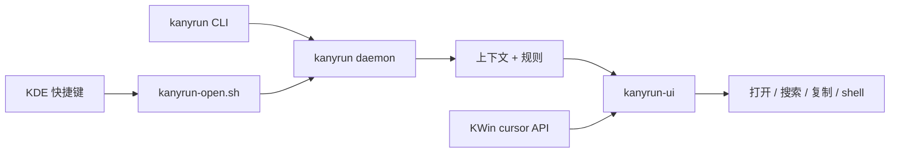

# Kanyrun - KDE Plasma 6 / Wayland 上下文启动器

<p align="center">
  <strong>在鼠标位置弹出上下文菜单。</strong><br>
  一个受 RunAny 启发、基于 KWin API、常驻 daemon 和原生 Qt 菜单 UI 的 KDE 专用启动器。
</p>

<p align="center">
  <a href="README.md">English</a> | 中文
</p>

---

> [!NOTE]
> Kanyrun 当前只面向 KDE Plasma 6 / Wayland。它依赖 KDE/KWin 的行为和 API，不是通用的 GNOME、X11、macOS 或 Windows 启动器。

## 简要介绍

Kanyrun 是一个 KDE Plasma 6 / Wayland 上的轻量上下文启动器。它可以根据当前文本、URL、文件、目录或多文件选择弹出对应菜单，然后执行配置好的动作：打开 PDF、在 Dolphin 中定位图片、搜索选中文本、复制路径，或运行任意 shell 命令。

项目灵感来自 [RunAny](https://github.com/hui-Zz/RunAny)。Kanyrun 继承的是 RunAny 那种“一个菜单配置驱动很多动作”的思路，以及 quick menu 风格的文本配置；但实现方式不是移植，而是重新面向 KDE Plasma / Wayland 设计：核心逻辑使用 Rust，菜单 UI 使用 Qt 6 / LayerShellQt，坐标和桌面集成尽量交给 KWin API。



## 功能特性

- **KDE Wayland 优先** - 使用 KWin 相关能力处理鼠标位置，不把坐标逻辑堆在 shell 脚本里。
- **文件和文本上下文菜单** - 支持 URL、普通文本、文件、目录、多文件列表、MIME 类型和扩展名菜单。
- **RunAny 风格菜单文件** - 使用紧凑的 `menu.ini`，支持子菜单、默认项、分隔线和 shell 命令。
- **常驻 daemon** - 默认通过 daemon 复用配置、规则和 warm UI 路径，减少连续触发时的冷启动开销。
- **原生 Qt 菜单 UI** - 使用 Qt 6 和 LayerShellQt 显示桌面菜单，并支持新菜单打开时关闭旧菜单。
- **外部选择脚本** - `kanyrun-open.sh` 可直接接收文件参数，也能通过复制快捷键兼容 Dolphin 和文件搜索工具。
- **内置动作** - 支持打开 URL、搜索 provider、复制文本、复制路径、打开文件、打开目录、定位文件和自定义命令。
- **按需调试 timing** - 只有 `--debug` 才启用 timing 日志；普通启动不承担 timing instrumentation 开销。

## 致谢

感谢 hui-Zz 的 RunAny。RunAny 展示了分类菜单、快捷启动、规则、搜索和脚本动作组合在一起可以达到很高的效率。Kanyrun 不是 RunAny 的移植版，而是一个 KDE Plasma / Wayland 版本的重新设计。

## 保留了什么

- 易编辑、易同步的纯文本菜单配置。
- 带默认动作的分类 quick menu。
- 同一个快捷键根据文本、URL、文件、目录或多文件选择执行不同动作。
- 面向 shell 的开放式扩展，而不是封闭插件模型。

## 改了什么

### 1. KDE / KWin 集成

Kanyrun 假设运行环境是 KDE Plasma 6 和 Wayland。菜单位置由 KWin cursor 信息和 LayerShellQt 共同完成，避免脚本层承担不稳定的坐标解析。

### 2. Rust 核心和常驻 daemon

Rust CLI 负责解析上下文、加载配置、匹配规则，并默认连接常驻 daemon。daemon 保持热路径可用，并可以维持 warm UI 子进程，让连续触发更快。

### 3. Unix 风格边界

`kanyrun-open.sh` 只做外部程序和快捷键的胶水层。菜单逻辑保留在 `kanyrun` 里；脚本只负责收集或转发上下文，并在 `--debug` 时输出调试 timing。

### 4. 无调试参数时没有 timing 开销

timing 日志是显式开启的：

```sh
kanyrun --debug --menu --files /tmp/example.pdf
kanyrun-open.sh --debug /tmp/example.pdf
```

不传 `--debug` 时，Rust timing span 不启用，shell 启动脚本也不会写 timing 日志。

## 技术栈

| 层 | 技术 |
| --- | --- |
| 核心 CLI 和 daemon | Rust、serde、TOML、Unix domain socket |
| 上下文识别 | 显式 CLI 参数、primary selection、clipboard、MIME guessing |
| 菜单 UI | C++17、Qt 6 Widgets、Qt DBus、LayerShellQt |
| 桌面集成 | KDE Plasma 6、Wayland、KWin API |
| 启动脚本 | Bash、`dotool` / `wtype` 复制快捷键 fallback |
| 配置 | `config.toml`、RunAny 风格 `menu.ini` |

## 安装

### 使用仓库中的 release bundle

```sh
bash release/install.sh
```

安装后会写入：

- 程序：`~/.local/share/kanyrun/`
- 命令链接：`~/.local/bin/kanyrun`
- 用户配置：`~/.config/kanyrun/`
- bundled 默认配置：`~/.local/share/kanyrun/config/`

### 从源码构建

依赖：

- Rust toolchain 和 Cargo
- CMake
- Qt 6 Core、Gui、Widgets、DBus 开发文件
- LayerShellQt 开发头文件和运行库
- 实际桌面使用需要 KDE Plasma 6 / Wayland

```sh
git clone https://github.com/sullevy/Kanyrun.git
cd Kanyrun
bash scripts/build-release.sh
bash release/install.sh
```

## 快速开始

1. 执行 `bash scripts/build-release.sh` 和 `bash release/install.sh` 构建并安装。
2. 运行 `kanyrun` 打开默认 root 菜单。
3. 在 KDE 全局快捷键中绑定 `~/.local/bin/kanyrun`，用于默认菜单。
4. 再绑定 `~/.local/share/kanyrun/kanyrun-open.sh`，用于当前文件、目录或文本的上下文菜单。
5. 编辑 `~/.config/kanyrun/menu.ini`，加入自己的真实命令。
6. 编辑 `~/.config/kanyrun/config.toml`，调整 provider、规则和 fallback 菜单。
7. 使用 `kanyrun --help` 查看 CLI 参数。
8. 只有需要测启动耗时时才加 `--debug`。

## 配置

Kanyrun 主要使用两个文件：

- `~/.config/kanyrun/config.toml` - 规则、provider、UI 开关和默认菜单文件。
- `~/.config/kanyrun/menu.ini` - quick menu 菜单结构和命令。

最小 `menu.ini` 示例：

```ini
*Search|@search:duckduckgo
GitHub search|@search:github
Copy text|@copy-text

-PDF::pdf
    *Open PDF|@open-file
    Show in folder|@reveal-file
    Copy path|@copy-path

-Directory::directory
    *Open folder|@open-file
    Copy path|@copy-path
```

内置动作：

- `@search:<provider>`
- `@copy-text`
- `@copy-path`
- `@open-file`
- `@open-directory`
- `@reveal-file`

占位符：

- `%s` - 当前文本
- `%f` - 当前文件路径
- `{text_preview}` - 文本菜单预览
- `%A_YYYY%`、`%A_MM%`、`%A_DD%`、`%A_Hour%`、`%A_Min%`、`%A_Sec%` - 时间变量

更多例子见 `使用说明.md`、`USAGE.md`、`assets/config/menu_sample.ini` 和 `assets/config/config.sample.toml`。

## CLI 示例

```sh
kanyrun
kanyrun --root-menu
kanyrun --text 'https://example.com'
kanyrun --text 'hello world' --menu
kanyrun --files /tmp/file.pdf
kanyrun --menu --files /tmp/a.txt /tmp/b.txt
kanyrun --menu-file ~/.config/kanyrun/menu-work.ini --test
kanyrun --debug --files /tmp/file.pdf
```

## 项目结构

```text
Kanyrun/
├── src/                    # Rust CLI、daemon、规则、上下文识别
├── ui/kanyrun-ui/          # Qt 6 菜单 UI
├── assets/config/          # bundled 默认配置和样例
├── scripts/                # 构建和测试脚本
├── release/                # 生成后的 release bundle
└── kanyrun-open.sh         # 外部上下文启动脚本
```

## 限制

- 目标环境是 KDE Plasma 6 / Wayland。
- 设计上依赖 KWin 行为，其他 compositor 不保证可用。
- UI 二进制依赖 Qt 6 和 LayerShellQt。
- 暂无包管理器发布，当前使用仓库 release bundle 或源码构建。

## License

Kanyrun 使用 GNU General Public License v3.0 开源。完整协议见 `LICENSE`。
